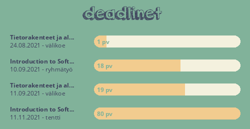

# KouluBot

## Komennot
prefix/etuliite = `!`
|Komento|Argumentit|Selitys|Esimerkki|
|--|--|--|--|
|ping|Ei argumentteja|Lähinnä testaukseen, botti vastaa komentoon "pong".|`!ping`|
|uusikurssi|Kurssin tunniste (+ kanava johon liitetään)|Hakee kurssin tiedot ja liittää sen halutulle kanavalle. Jos kanavaa ei määritellä valitsee kanavan jolta käsky annettiin.|`!uusikurssi 902150Y englanti_kanava`|
|poistakurssi|Poistettavan kurssin tunniste|Poistaa kurssin tiedot databasesta ja katkaisee yhteyden sen kanavaan.|`!poistakurssi 902150Y`|
|kurssit|Ei argumentteja|Listaa tallennetut kurssit|`!kurssit`|
|deadline|Päivämäärä + viesti|Yhdistää siihen kurssiin deadlinen, millä kanavalla komento suoritetaan.|`!deadline 12.5.21 essee`|
|deadlinet|Vaihtoehtoisena: --kaikki, --kuva|Listaa kanavaan tallennetun kurssin deadlinet tai kaikki deadlinet jos --kaikki käytössä. Lähettää deadlinet kuvana --kuva komennolla [1].|`!deadlinet`|
|lueics|Liitetiedosto ics-kalenteri|Lukee Moodlesta ladatun kalenteritiedoston ja tallettaa siihen kurssiin liittyvät deadlinet, jonka kanavalta käsky annettiin.|`!lueics`|
|luennot|Ei argumentteja|Listaa sen kurssin luennot tyypeittäin, millä kanavalla käsky annettiin|`!luennot`|
|seuraa|Luentotyyppi (+ luennon selite)|Tallentaa kurssityypin databaseen ja ilmoittaa kun kurssi on alkamassa. Tyypit näkee luennot-komennolla|`!seuraa 28370 laskari`|
|poistaseuraus|Luentotyyppi|Poistaa luentotyypin seurauksesta ja ei ilmoita enää, kun luennot ovat alkamassa|`!poistaseuraus 28370`|
|seuratut|Ei argumentteja|Näyttää sen kurssin seuratut luentotyypit, jonka kanavalla käsky annetaan|`!seuratut`|

[1]

## Botin loopit
||Aikaväli|Mitä tekee|
|--|--|--|
|__Deadline-tarkistus__|Kerran päivässä klo 12|Tarkistaa onko päivälle merkittynä deadlineja ja ilmoittaa niistä oikeilla kanavilla|
|__Luentojen päivitys__|Kerran päivässä klo 12|Hakee kaikkien kurssien luentoajat uudestaan muutosten varalta|
|__Luentomuistutukset__|10 min välein|Tarkistaa onko seurattu luento alkamassa 15min sisällä, jos on niin ilmoittaa oikealla kanavalla|

## Database schemat
### Kurssitaulukko (courses)
||id (integer)|peppi_id (text)|title (text)|channel_id (integer)|
|--|--|--|--|--|
|__Selitys__|Kurssin juokseva tunniste taulukossa|Kurssin tunniste pepissä|Kurssin lyhyt selite|Kanavan id, jolle yhdistetty|
|__Esimerkki__|`3`|`902150Y`|`Professional English for Tecnology, ETT (1. vsk) ja ETT (2. vsk) KEVÄT`|`809348914829459496`|

### Deadlinetaulukko (deadlines)
||id (integer)|course_id (integer)|timestamp (integer)|message (text)|
|--|--|--|--|--|
|__Selitys__|Deadlinen juokseva tunniste taulukossa|Kurssin id, jota deadline koskee|Deadlinen päivämäärä epoch-muodossa|Deadlinen kuvaus|
|__Esimerkki__|`2`|`1`|`1613133521`|`Esseen palautus`|

### Luentoajat -taulukko (lectures)
||id (integer)|course_id (integer)|start_timestamp (integer)|end_timestamp (integer)|location (text)|lecture_type (text)|
|--|--|--|--|--|--|--|
|__Selitys__|Luentoajan juokseva tunniste|Kurssin id, jonka luento on kyseessä|Luennon alkamisajan kohta epoch-muodossa|Luennon loppumisajankohta epoch-muodossa|Luennon sijainti|Luentotyypin id, esim. aina tiistaisin klo 10 alkavilla luennoilla on sama luentotyyppi|
|__Esimerkki__|`5`|`4`|`1613133761`|`1613138365`|`Zoom`|`2148`|

### Seuratut luentotyypit -taulukko (followed_lecture_types)
||id (integer)|lecture_type (integer)|course_id (integer)|title (text)|
|--|--|--|--|--|
|__Selitys__|Seuratun luentotyypin juokseva tunniste|Luentotyyppi|Kurssin id, jonka luentotyyppi on kyseessä|Luentotyypille annettu otsikko esim. luento, laskari, tentti|
|__Esimerkki__|`5`|`2148`|`3`|`Laskari`|

